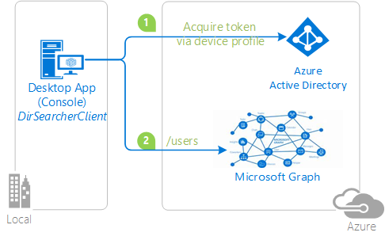

---
extensions:
    services: active-directory
    platforms: java
    author: ramya25
    level: 200
    client: java console app
    service: Microsoft Graph
    endpoint: Microsoft identity platform
page_type: sample
languages:
  - java  
products:
  - azure
  - azure-active-directory  
  - ms-graph
  - entra
description: "This sample demonstrates calling the Microsoft Graph from a Java console application without a browser for interaction"
urlFragment: msal-java-invoking-protected-api-device-code
---

# Invoking an API protected by Azure AD from a device without a browser for interaction

## About this sample

### Overview

This sample shows how to use the OAuth 2.0 [device code flow](https://docs.microsoft.com/azure/active-directory/develop/v2-oauth2-device-code)to sign in users to input-constrained devices such as a smart TV, IoT device, or printer. It leverages [MSAL for Java (MSAL4J)](https://github.com/AzureAD/microsoft-authentication-library-for-java) from an app that **does not have the capability of offering an interactive authentication experience**. It enables these apps to:

- Authenticate a user
- Acquire an [access token](https://docs.microsoft.com/azure/active-directory/develop/access-tokens) for a web API (in this case, the [Microsoft Graph](https://graph.microsoft.com))

To emulate an app on a device that is not capable of showing a UX, the sample is packaged as a Java console application.
The application signs-in users with Azure Active Directory (Azure AD), using the Microsoft Authentication Library for Java (MSAL4J) to obtain a JWT access token through the OAuth 2.0 protocol. The access token is then used to call the Microsoft Graph API to obtain information about the user who signed-in. The sample is structured as such so that you can call your own API.



### Scenario

The application obtains tokens through a two step process especially designed for devices and operating systems that cannot display any UX. Examples of such applications are applications running on IoT, or Command-Line tools (CLI). The idea is that:

1. Whenever a user is required to authenticate, the command-line app provides a code and asks the user to use another device (such as an internet-connected smartphone) to navigate to [https://microsoft.com/devicelogin](https://microsoft.com/devicelogin), where the user will be prompted to enter the code provided earlier. Once the user enters the code, the web page will lead the user through a normal authentication experience, including presenting any consent prompts and taking the user through a multi-factor authentication experience if necessary.

1. Upon successful authentication, the command-line app will receive the required tokens through a back channel and will use it to perform the web API calls it needs. In this case, the sample retrieves a list of users in the signed-in user's tenant from Microsoft Graph and lists it in the window.

## How to run this sample

To run this sample, you'll need:

- Working installation of [Java 8 or greater](https://openjdk.java.net/install/) and [Maven](https://maven.apache.org/).
- An Azure Active Directory (Azure AD) tenant. For more information on how to get an Azure AD tenant, see [How to get an Azure AD tenant](https://azure.microsoft.com/documentation/articles/active-directory-howto-tenant/).
- One or more user accounts in your Azure AD tenant.

### Step 1:  Clone or download this repository

From your shell or command line:

```Shell
git clone https://github.com/Azure-Samples/ms-identity-java-devicecodeflow.git
```

or download and extract the repository .zip file.

### Step 2:  Register the sample application with your Azure Active Directory tenant

To register the project, you can:

- either follow the steps [Step 2: Register the sample with your Azure Active Directory tenant](#step-2-register-the-sample-application-with-your-azure-active-directory-tenant) and [Step 3:  Configure the sample to use your Azure AD tenant](#choose-the-azure-ad-tenant-where-you-want-to-create-your-applications)
- or use PowerShell scripts that:
  - **automatically** create for you the Azure AD applications and related objects (passwords, permissions, dependencies)
  - modify the project's configuration files.

If you want to use this automation, read the instructions in [App Creation Scripts](./AppCreationScripts/AppCreationScripts.md)
Please note that the configuration of your code (Step 3) still needs to be done manually.

Follow the steps below to manually walk through the steps to register and configure the applications.

#### Choose the Azure AD tenant where you want to create your applications

As a first step you'll need to:

1. Sign in to the [Azure portal](https://portal.azure.com) using either a work or school account or a personal Microsoft account.
1. If your account is present in more than one Azure AD tenant, select your profile at the top right corner in the menu on top of the page, and then **switch directory**.
   Change your portal session to the desired Azure AD tenant.
1. In the portal menu, select the **Azure Active Directory** service, and then select **App registrations**.

#### Register the client app (active-directory-java-deviceprofile)

1. Navigate to the Microsoft identity platform for developers [App registrations](https://go.microsoft.com/fwlink/?linkid=2083908) page.
1. Click **New registration** on top.
1. In the **Register an application page** that appears, enter your application's registration information:
   - In the **Name** section, enter a meaningful application name that will be displayed to users of the app, for example `active-directory-java-deviceprofile`.
   - Change **Supported account types** to **Accounts in any organizational directory**.
1. Click on the **Register** button at the bottom to create the application.
1. In the app's registration screen, find the **Application (client) ID** value and record it for later. You'll need it to configure the configuration file(s) later in your code.
1. In the app's registration screen, click on the **Manifest** blade, and:
   - In the manifest editor, set the ``allowPublicClient`` property to **true**
   - Click on **Save** in the bar above the manifest editor.
1. In the app's registration screen, click on the **Authentication** blade in the left and:
   - In the **Platform configurations** section select **Add a platform** and create a new **Mobile and desktop** application
   - Enter the following as the redirect URI: **https://login.microsoftonline.com/common/oauth2/nativeclient**
   - Click on **Configure** to save your changes.
1. In the app's registration screen, click on the **API permissions** blade in the left to open the page where we add access to the Apis that your application needs. You will need both **User.Read** and **User.ReadBasic.All** permissions for this sample.
   - Click the **Add a permission** button, and select **Microsoft Graph**
   - Choose **Delegated permissions**, and select **User.Read** and **User.ReadBasic.All** in the list. Use the search box if necessary.
   - Click on the **Add permissions** button at the bottom to save your changes.

##### Configure the  client app (active-directory-java-deviceprofile) to use your app registration

Open the project in your IDE to configure the code.
>In the steps below, "ClientID" is the same as "Application ID" or "AppId".

1. Open the `src\main\java\DeviceCodeFlow` class
1. Find the variable `CLIENT_ID` and replace the existing value with the application ID (clientId) that you recorded in earlier steps.

### Step 4: Run the sample

From your shell or command line:

- `$ mvn clean compile assembly:single`

This will generate a `ms-identity-java-devicecodeflow-1.0.jar` file in your /targets directory. Run this using your Java executable like below:

- `$ java -jar ms-identity-java-devicecodeflow-1.0.jar`

`Or` run it from an IDE.

Application will start and it will display similar as below:

> To sign in, use a web browser to open the page https://microsoft.com/devicelogin and enter the code ABCDEF123 to authenticate.

Now you can navigate to the above URL and it will then prompt to enter the code which is displayed as above. After successful authentication of the user, the webpage displays a window as below:

> You have signed in to the `active-directory-java-deviceprofile` on your device. You may now close this window.

Now you can come back your application and you can see the users list and basic information of the users in the tenant.

## About the code

1. The relevant code for this sample is in the `DeviceCodeFlow.java` file.

The code below calls the `acquireToken` method of the **PublicClientApplication** class to which you pass a callback that will display information to the user about where they should navigate to, and which code to enter to initiate a sign-in.

```Java
PublicClientApplication app = PublicClientApplication.builder(PUBLIC_CLIENT_ID)
                .authority(AUTHORITY_COMMON)
                .build();

        Consumer<DeviceCode> deviceCodeConsumer = (DeviceCode deviceCode) -> {
            System.out.println(deviceCode.message());
        };

        CompletableFuture<IAuthenticationResult> future = app.acquireToken(
                DeviceCodeFlowParameters.builder(
                        Collections.singleton(GRAPH_SCOPE),
                        deviceCodeConsumer)
                        .build());
```

## Community Help and Support

Use [Stack Overflow](http://stackoverflow.com/questions/tagged/msal) to get support from the community.
Ask your questions on Stack Overflow first and browse existing issues to see if someone has asked your question before.
Make sure that your questions or comments are tagged with [`azure-active-directory` `msal` `java`].

If you find a bug in the sample, please raise the issue on [GitHub Issues](../../issues).

To provide a recommendation, visit the following [User Voice page](https://feedback.azure.com/forums/169401-azure-active-directory).

## Contributing

If you'd like to contribute to this sample, see [CONTRIBUTING.MD](/CONTRIBUTING.md).

This project has adopted the [Microsoft Open Source Code of Conduct](https://opensource.microsoft.com/codeofconduct/). For more information, see the [Code of Conduct FAQ](https://opensource.microsoft.com/codeofconduct/faq/) or contact [opencode@microsoft.com](mailto:opencode@microsoft.com) with any additional questions or comments.

## More information

For more information, see:

- MSAL4J [conceptual documentation](https://github.com/AzureAD/microsoft-authentication-library-for-java/wiki).
- [Device Code Flow for devices without a Web browser](https://github.com/AzureAD/microsoft-authentication-library-for-java/wiki/Device-Code-Flow).
- [In-memory Token cache](https://github.com/AzureAD/microsoft-authentication-library-for-java/wiki/Token-Cache)
- [Microsoft identity platform (Azure Active Directory for developers)](https://docs.microsoft.com/azure/active-directory/develop/)
- [Quickstart: Register an application with the Microsoft identity platform (Preview)](https://docs.microsoft.com/azure/active-directory/develop/quickstart-register-app)
- [Quickstart: Configure a client application to access web APIs (Preview)](https://docs.microsoft.com/azure/active-directory/develop/quickstart-configure-app-access-web-apis)

- [Understanding Azure AD application consent experiences](https://docs.microsoft.com/azure/active-directory/develop/application-consent-experience)
- [Understand user and admin consent](https://docs.microsoft.com/azure/active-directory/develop/howto-convert-app-to-be-multi-tenant#understand-user-and-admin-consent)
- [Application and service principal objects in Azure Active Directory](https://docs.microsoft.com/azure/active-directory/develop/app-objects-and-service-principals)

- [National Clouds](https://docs.microsoft.com/azure/active-directory/develop/authentication-national-cloud#app-registration-endpoints)

For more information about the Microsoft identity platform, see:

- [https://aka.ms/aadv2](https://aka.ms/aadv2)

For more information about how OAuth 2.0 protocols work in this scenario and other scenarios, see [Authentication Scenarios for Azure AD](http://go.microsoft.com/fwlink/?LinkId=394414)
