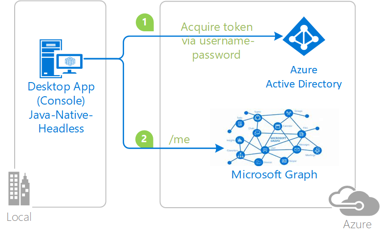

---
extensions:
    services: active-directory
    platforms: Java
    endpoint: Microsoft identity platform
page_type: sample
languages:
  - java
author: ramya25
products:
  - azure
  - azure-active-directory
  - msal-java
  - ms-graph
  - entra
description: "Java console application letting users sign-in with their username/password and call Microsoft Graph API"
urlFragment: msal-java-client-username-password
---

# Java console application letting users sign-in with username/password and call Microsoft Graph API

## About this sample

### Overview

This sample demonstrates how to use Microsoft Authentication Library for Java to:

- Authenticate the user silently using username and password.
- Call to a web API (in this case, the [Microsoft Graph](https://graph.microsoft.com))



### Scenario

The application obtains a token through username and password, and then calls the Microsoft Graph to get information about the signed-in user.

Note that Username/Password is needed in some cases (for instance devops scenarios) but it's not recommended because:

- This requires having credentials in the application, which does not happen with the other flows.
- The credentials should only be used when there is a high degree of trust between the resource owner and the client and when other authorization grant types are not available (such as an authorization code).
- Do note that this attempts to authenticate and obtain tokens for users using this flow will often fail with applications registered with Azure AD. Some of the situations and scenarios that will cause the failure are listed below  
  - When the user needs to consent to permissions that this application is requesting.
  - When a conditional access policy enforcing multi-factor authentication is in force.
  - Azure AD Identity Protection can block authentication attempts if this user account is compromised.
  - The user's password is expired and requires a reset.

While this flow seems simpler than the others, applications using these flows often encounter more problems as compared to other flows.

The modern authentication protocols (SAML, WS-Fed, OAuth and OpenID), in principal, discourage apps from handling user credentials themselves. The aim is to decouple the authentication method from an app. Azure AD controls the login experience to avoid exposing secrets (like passwords) to a website or an app.

This enables IdPs like Azure AD to provide seamless single sign-on experiences, enable users to authenticate using factors other than passwords (phone, face, biometrics) and Azure AD can block or elevate authentication attempts if it discerns that the user’s account is compromised or the user is trying to access an app from an untrusted location and such.

## How to run this sample

To run this sample, you'll need:

- Working installation of Java and Maven.
- An Internet connection.
- An Azure Active Directory (Azure AD) tenant. For more information on how to get an Azure AD tenant, see [How to get an Azure AD tenant](https://azure.microsoft.com/en-us/documentation/articles/active-directory-howto-tenant/).
- A user account in your Azure AD tenant. This sample will not work with a Microsoft account (formerly Windows Live account). Therefore, if you signed in to the [Azure portal](https://portal.azure.com) with a Microsoft account and have never created a user account in your directory before, you need to do that now.

## Quick Start

Getting started with the sample is easy. It is configured to run out of the box with minimal setup.

### Step 1: Download Java (8 and above) for your platform

To successfully use this sample, you need a working installation of [Java](http://www.oracle.com/technetwork/java/javase/downloads/index.html) and [Maven](https://maven.apache.org/).

### Step 2:  Clone or download this repository

From your shell or command line:

```Shell
git clone https://github.com/Azure-Samples/ms-identity-java-desktop.git
cd "Username-Password-Flow"
```

### Step 3:  Register the sample with your Azure Active Directory tenant

To register the project, you can:

- either follow the steps in the paragraphs below
- or use PowerShell scripts that:
  - **automatically** create for you the Azure AD applications and related objects (passwords, permissions, dependencies)
  - modify the projects' configuration files.

If you want to use this automation, read the instructions in [App Creation Scripts](./AppCreationScripts/AppCreationScripts.md)

### First step: choose the Azure AD tenant where you want to create your applications

As a first step you'll need to:

1. Sign in to the [Azure portal](https://portal.azure.com) using either a work or school account or a personal Microsoft account.
1. If your account is present in more than one Azure AD tenant, select your profile at the top right corner in the menu on top of the page, and then **switch directory**.
   Change your portal session to the desired Azure AD tenant.
1. In the portal menu, click on **All services**, and choose **Azure Active Directory**.

> In the next steps, you might need the tenant name (or directory name) or the tenant ID (or directory ID). These are presented in the **Properties** of the Azure Active Directory window respectively as *Name* and *Directory ID*

#### Register the app app (Java-Console-Application)

1. Navigate to the Microsoft identity platform for developers [App registrations](https://go.microsoft.com/fwlink/?linkid=2083908) page.
1. Click **New registration**.
1. When the **Register an application page** appears, enter your application's registration information:
   - In the **Name** section, enter a meaningful application name that will be displayed to users of the app, for example `Java-Console-Application`.
   - In the **Supported account types** section, select **Accounts in any organizational directory**.
1. Select **Register** to create the application.
1. In the app's registration **Overview** page, find the **Application (client) ID** value and record it for later. You'll need it to configure the APP_ID value in `UsernamePasswordFlow.Java` later.
1. In the Application menu blade, select **Manifest**, and:
   - In the manifest editor, set the `allowPublicClient` property to **true**
   - Select **Save** in the bar above the manifest editor.
1. In the Application menu blade, select **API permissions**
   - Ensure that the **User.Read** permission is listed in the permissions list (which is automatically added when you register your application).

1. At this stage permissions are assigned correctly but the client app does not allow interaction.
   Therefore no consent can be presented via UI and accepted to use the service app.
   Click the **Grant/revoke admin consent for {tenant}** button, and then select **Yes** when you are asked if you want to grant consent for the requested permissions for all accounts in the tenant.
   You need to be an Azure AD tenant admin to do this.

### Step 4:  Configure the sample to use your Azure AD tenant

In the steps below, ClientID is the same as Application ID or AppId.

#### Configure the app project

1. Open the `src\main\resources\application.properties` file
1. Set the `CLIENT_ID` property to the client ID value you recorded earlier
1. Set the `USER_NAME` and `USER_PASSWORD` properties to the username and password of the user you wish to authenticate in this sample

### Step 5: Run the sample

From your shell or command line:

- `$ mvn clean compile assembly:single`

This will generate a `public-client-msal4j-sample-jar-with-dependencies.jar` file in your /targets directory. Run this using your Java executable like below:

- `$ java -jar public-client-msal4j-sample-jar-with-dependencies.jar`

### You're done

Simply run the .jar file as described in step 5 or run the main method of `UsernamePasswordFlow.java` in your IDE to watch the sample acquire a token for the user you configured.

### About the code

The code to acquire a token is located entirely in `src\main\java\UsernamePasswordFlow.Java`. The public client application is created using the **MSAL build pattern**, by passing the Application ID, an authority, and an implementation of the token cache interface.

```java
            PublicClientApplication pca = PublicClientApplication.builder(clientId)
                            .authority(authority)
                            .setTokenCacheAccessAspect(tokenCacheAspect)
                            .build();
```

A call to acquire the token is first made using the public client application, by creating a `SilentParameters` object to send to the application's `acquireTokenSilently()` method. The `SilentParameters` builder takes in an account (taken from the token cache) and a set of scopes. `acquireTokenSilently()` retrieves that account's token from the cache if one exists and isn't expired. If the token is expired, an attempt to retireve a new token is made if the cache contains a refresh token. 

If there is no token in the cache for the given account or some issue occurs when trying to use a refresh token, the code falls back to the username/password flow described below

```java
            SilentParameters silentParameters =
                    SilentParameters
                            .builder(scope)
                            .account(account)
                            .build();

            result = pca.acquireTokenSilently(silentParameters).join();

```

A call to acquire the token is first made using the public client application, by creating a `UserNamePasswordParameters` object to send to the application's `acquireToken()` method. The `UserNamePasswordParameters` builder takes in the username and password of a user, and a set of scopes. `acquireToken()` attempts to acquires a token from the authority configured in the application via the username/password authentication. 

```java
            UserNamePasswordParameters parameters =
                    UserNamePasswordParameters
                            .builder(scope, username, password.toCharArray())
                            .build();

            result = pca.acquireToken(parameters).join();
```

## Community Help and Support

Use [Stack Overflow](http://stackoverflow.com/questions/tagged/msal) to get support from the community.
Ask your questions on Stack Overflow first and browse existing issues to see if someone has asked your question before.
Make sure that your questions or comments are tagged with [`msal` `Java`].

If you find a bug in the sample, please raise the issue on [GitHub Issues](https://github.com/Azure-Samples/ms-identity-java-desktop/issues).

To provide a recommendation, visit the following [User Voice page](https://feedback.azure.com/forums/169401-azure-active-directory).

## Contributing

If you'd like to contribute to this sample, see CONTRIBUTING.md

This project has adopted the [Microsoft Open Source Code of Conduct](https://opensource.microsoft.com/codeofconduct/). For more information, see the [Code of Conduct FAQ](https://opensource.microsoft.com/codeofconduct/faq/) or contact [opencode@microsoft.com](mailto:opencode@microsoft.com) with any additional questions or comments.

## More information

For more information, see MSAL4J [conceptual documentation](https://github.com/AzureAD/microsoft-authentication-library-for-java/wiki).

- [Quickstart: Configure a client application to access web APIs](https://docs.microsoft.com/azure/active-directory/develop/quickstart-configure-app-access-web-apis)
- [Understanding Azure AD application consent experiences](https://docs.microsoft.com/azure/active-directory/develop/application-consent-experience)
- [Understand user and admin consent](https://docs.microsoft.com/azure/active-directory/develop/howto-convert-app-to-be-multi-tenant#understand-user-and-admin-consent)
- About how OAuth 2.0 protocols work in this scenario and other scenarios, see [Authentication Scenarios for Azure AD](http://go.microsoft.com/fwlink/?LinkId=394414).

For more information about how OAuth 2.0 protocols work in this scenario and other scenarios, see [Authentication Scenarios for Azure AD](http://go.microsoft.com/fwlink/?LinkId=394414).
