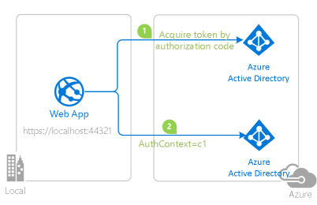
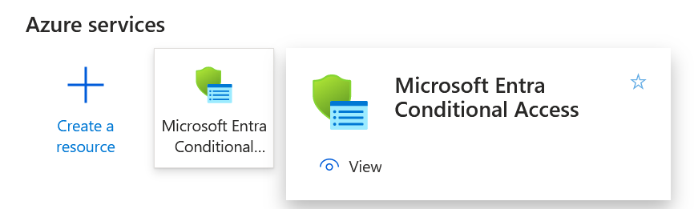
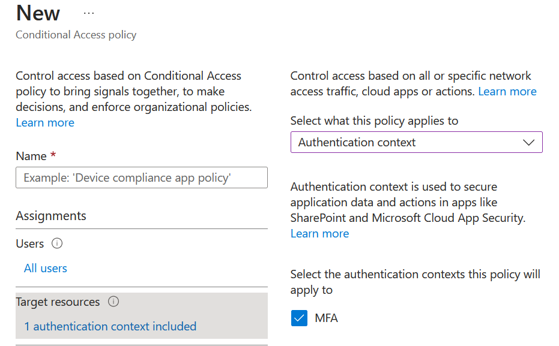
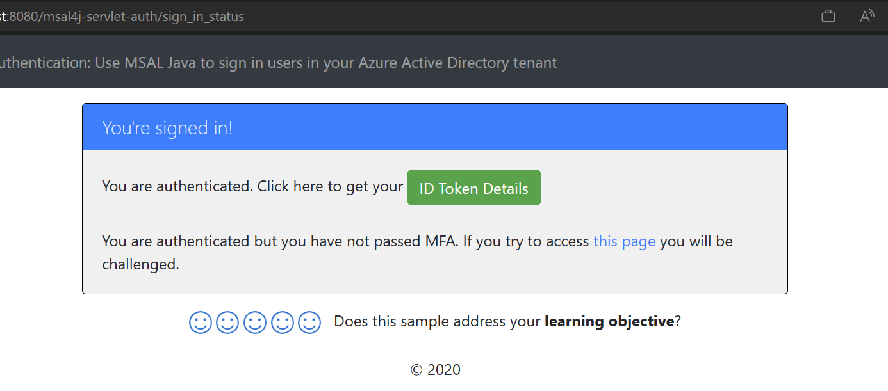

# Enable your Java Servlet web app to sign in users to your Azure Active Directory tenant with the Microsoft identity platform


## Overview

This sample demonstrates a Java Servlet web app that signs users in to your Microsoft Entra tenant using the [Microsoft Authentication Library (MSAL) for Java](https://learn.microsoft.com/entra/msal/java/).
It also demonstrates how to step-up the authentication challenge by requiring multi-factor authentication (MFA) for certain routes.



>**Note**
>Make sure you understand the [basic web site authentication sample](https://github.com/Azure-Samples/ms-identity-msal-java-samples/tree/bogavril/auth-context/3-java-servlet-web-app/1-Authentication/sign-in) first. This shows how to sign users in.

## Scenario

This web application shows how to challenge users to authenticate for some routes and challenge users to authenticate and perform MFA for other routes.

1. Some web site actions (routes) need the user to be authenticated and others require the user to be
authenticated and to have passed the MFA challenge.
1. An authentication context `c1` has already been created and associated with MFA
1. If an MFA route is accessed by the user, the ID token is checked for proof of MFA - a claim named `arcs` with the value `C1`
1. If an ID token does not exist (i.e., user is not authenticated at all) or if the claim does not exist (they have not passed the MFA challenge), the user is challenged to MFA. This means that they are redirected to the authorization page and a claims challenge is appended to the authorization URI. 


Example claim challenge: `{"id_token":{"acrs":{"essential":true,"value":"c1"}}}`

>**Note**
>MFA is one of the many [Conditional Access](https://learn.microsoft.com/azure/active-directory/conditional-access/overview) controls available. Any of them may be used.

## Contents

| File/folder                                                        | Description                                                                            |
| ------------------------------------------------------------------ | -------------------------------------------------------------------------------------- |
| `AppCreationScripts/`                                              | Scripts to automatically configure Azure AD app registrations.                         |
| `src/main/java/com/microsoft/azuresamples/msal4j/authwebapp/`      | This directory contains the classes that define the web app's backend business logic.  |
| `src/main/java/com/microsoft/azuresamples/msal4j/authservlets/`    | This directory contains the classes that are used for sign in and sign out endpoints.  |
| `____Servlet.java`                                                 | All of the endpoints available are defined in .java classes ending in ____Servlet.java.|
| `src/main/java/com/microsoft/azuresamples/msal4j/helpers/`         | Helper classes for authentication.                                                     |
| `AuthenticationFilter.java`                                        | Redirects unauthenticated requests to protected endpoints to a 401 page.               |
| `src/main/resources/authentication.properties`                     | Azure AD and program configuration.                                                    |
| `src/main/webapp/`                                                 | This directory contains the UI (JSP templates)                                         |
| `CHANGELOG.md`                                                     | List of changes to the sample.                                                         |
| `CONTRIBUTING.md`                                                  | Guidelines for contributing to the sample.                                             |
| `LICENSE`                                                          | The license for the sample.                                                            |

## Prerequisites

- [JDK Version 8 or higher](https://jdk.java.net/8/)
- [A Microsoft Entra premium tenant](https://azure.microsoft.com/pricing/details/active-directory/) is required to work with Conditional Access policies.
- [How to get a Microsoft Entra tenant](https://azure.microsoft.com/documentation/articles/active-directory-howto-tenant/)
- A user account in your own Microsoft Entra tenant if you want to work with **accounts in your organizational directory only** (single-tenant mode). If have not yet [created a user account](https://docs.microsoft.com/azure/active-directory/fundamentals/add-users-azure-active-directory) in your Microsoft Entra tenant yet, you should do so before proceeding.

## Setup

### 1. Clone or download this repository

From your shell or command line:

```console
git clone https://github.com/Azure-Samples/ms-identity-msal-java-samples.git
cd 3-java-servlet-web-app/1-Authentication/sign-in-auth-context
```

or download and extract the repository .zip file.

> :warning: To avoid file path length limitations on Windows, clone the repository into a directory near the root of your hard drive.
### 2. Create a Microsoft Entra application registration for the website

>**Note**
>This is identical to the [basic web site authentication sample](https://github.com/Azure-Samples/ms-identity-msal-java-samples/tree/bogavril/auth-context/3-java-servlet-web-app/1-Authentication/sign-in).

<details>

<summary>Details here</summary>

[Register a new web app](https://learn.microsoft.com/azure/active-directory/develop/quickstart-register-app) in the [Azure Portal](https://portal.azure.com).
Following this guide, you must:

1. Navigate to the Microsoft identity platform for developers [App registrations](https://go.microsoft.com/fwlink/?linkid=2083908) page.
1. Select **New registration**.
1. In the **Register an application page** that appears, enter your application's registration information:
    - In the **Name** section, enter a meaningful application name that will be displayed to users of the app, for example `java-servlet-webapp-authentication`.
    - Under **Supported account types**, select an option.
        - Select **Accounts in this organizational directory only** if you're building an application for use only by users in your tenant (**single-tenant**).
        - Select **Accounts in any organizational directory** if you'd like users in any Azure AD tenant to be able to use your application (**multi-tenant**).
        - Select **Accounts in any organizational directory and personal Microsoft accounts** for the widest set of customers (**multi-tenant** that also supports Microsoft personal accounts).
    - Select **Personal Microsoft accounts** for use only by users of personal Microsoft accounts (e.g., Hotmail, Live, Skype, Xbox accounts).
    - In the **Redirect URI** section, select **Web** in the combo-box and enter the following redirect URI: `http://localhost:8080/msal4j-servlet-auth/auth/redirect`.
1. Select **Register** to create the application.
1. In the app's registration screen, find and note the **Application (client) ID**. You use this value in your app's configuration file(s) later in your code.
1. Select **Save** to save your changes.
1. In the app's registration screen, click on the **Certificates & secrets** blade in the left to open the page where we can generate secrets and upload certificates.
1. In the **Client secrets** section, click on **New client secret**:
    - Type a key description (for instance `app secret`),
    - Select one of the available key durations (**In 1 year**, **In 2 years**, or **Never Expires**) as per your security concerns.
    - The generated key value will be displayed when you click the **Add** button. Copy the generated value for use in the steps later.
    - You'll need this key later in your code's configuration files. This key value will not be displayed again, and is not retrievable by any other means, so make sure to note it from the Azure portal before navigating to any other screen or blade.


### Configure the web app (java-servlet-webapp-authentication) to use your app registration

Open the project in your IDE to configure the code.

> In the steps below, "ClientID" is the same as "Application ID" or "AppId".

1. Open the `./src/main/resources/authentication.properties` file
2. Find the string `{enter-your-tenant-id-here}`. Replace the existing value with you tenant id
3. Find the string `{enter-your-client-id-here}` and replace the existing value with the application ID (clientId) of the `java-servlet-webapp-authentication` application copied from the Azure portal.
4. Find the string `{enter-your-client-secret-here}` and replace the existing value with the key you saved during the creation of the `java-servlet-webapp-authentication` app, in the Azure portal.

</details>

### 3. Setup the MFA Conditional Access Context

1. In the Azure Portal, type Microsoft Entra Conditional Access in the search bar and select it.



Note: this is a different Azure Portal section than Microsoft Entra ID

2. Go to the `Authentication Contexts` page, and click on `New Authentication context`. Give it a name (e.g. "MFA") and select an ID of the Auth context from the list, for example `c1`. Ensure the "Publish To Apps" checkbox is checked. Make a note of the ID.

**Note:** We have already configured the conditional access auth context ID to `c1` in the code for you but you can modify it in the `authentication.properties` file.
Modify the value of `app.protect.authContextIdMfa` to any ID you want but make sure it matches the ID you chose in the portal.

3. Now go to Policies and create a new Conditional Access policy. 
    - **Name** it `MFA-app-policy` or something meaningful.
    - Select **All Users** or a subset of users.
    - Select **Target Resources** and set it to **Authentication Context**. Then add the context you just created.
    - You can skip the "Conditions" part of the flow. This policy will apply to all calls.
    - In **Grant**, check the **Require Multi-Factor Authentication** policy.
    - You can skip **Session**.
    - Click the **Select** button then click **Create**.



## Running The Sample

#### Build .war File Using Maven

1. Navigate to the directory containing the pom.xml file for this sample (the same directory as this README), and run the following Maven command:
    ```
    mvn clean package
    ```
1. This should generate a `.war` file which can be run on a variety of application servers

#### Deploying the Sample
The homepage for the sample is `http://localhost:8080/msal4j-servlet-auth` as seen in the `authentication.properties` file

Our samples can be deployed to a number of application servers, such as Tomcat, WebLogic, or Webshpere, and MSAL Java itself can generally be integrated into existing applications without changes to your existing deployment set up.

You can find instructions for deploying our samples [here on MSAL Java's Github wiki](https://github.com/AzureAD/microsoft-authentication-library-for-java/wiki/Deployment-Instructions-for-MSAL-Java-Samples).



## Explore the sample


- In `authwebapp` there are 2 protected routes: `token_details` requires simple authentication and `token_details_mfa` which requires MFA.
- The orchestration logic is in the `AuthenticationFilter`. It figures out the state of the user (authenticated, authenticated + MFA, not authenticated) and the requirements of the route (based on configuration).
- If the auth requirement is not met, the user is challenged, meaning they are redirected to the Identity Provider (Microsoft Entra).
- To understand if a user meets the authentication context (MFA), the sample looks at the ID Token for a claim named `acrs` and value `c1`.
- To challenge a user if they are not authenticated, the sample adds a claims challenge to the authorization URI `claims={"id_token":{"acrs":{"essential":true,"value":"c1"}}}`


> :information_source: Did the sample not work for you as expected? Did you encounter issues trying this sample? Then please reach out to us using the [GitHub Issues](../../../../issues) page.

## We'd love your feedback!

Were we successful in addressing your learning objective? Consider taking a moment to [share your experience with us](https://github.com/Azure-Samples/ms-identity-msal-java-samples/issues).


## Next Steps or Deploy to Azure

As next steps, we can now either [get an Access Token for the users we signed-in in this tutorial](https://github.com/Azure-Samples/ms-identity-java-servlet-webapp-call-graph), or we can proceed [to deploy this app to Azure App Service](https://github.com/Azure-Samples/ms-identity-java-servlet-webapp-authentication/tree/main/4-Deployment/deploy-to-azure-app-service).

## Community Help and Support

Use [Stack Overflow](https://stackoverflow.com/questions/tagged/msal) to get support from the community.
Ask your questions on Stack Overflow first and browse existing issues to see if someone has asked your question before.
Make sure that your questions or comments are tagged with [`azure-active-directory` `ms-identity` `java` `msal`].

If you find a bug in the sample, please raise the issue on [GitHub Issues](../../../../issues).


## Contributing

This project welcomes contributions and suggestions. Most contributions require you to agree to a Contributor License Agreement (CLA) declaring that you have the right to, and actually do, grant us the rights to use your contribution. For details, visit https://cla.opensource.microsoft.com

## Code of Conduct

This project has adopted the Microsoft Open Source Code of Conduct. For more information see the Code of Conduct FAQ or contact opencode@microsoft.com with any additional questions or comments.

## More information

- [MSAL Java documentation](https://learn.microsoft.com/entra/msal/java/)
- [Microsoft Authentication Library \(MSAL\) for Java](https://github.com/AzureAD/microsoft-authentication-library-for-java)
- [MSAL Java Reference Documentation](https://learn.microsoft.com/java/api/overview/msal-java/)
- [Microsoft identity platform (Azure Active Directory for developers)](https://learn.microsoft.com/azure/active-directory/develop/)
- [Quickstart: Register an application with the Microsoft identity platform (Preview)](https://learn.microsoft.com/azure/active-directory/develop/quickstart-register-app)
- [Understanding Azure AD application consent experiences](https://learn.microsoft.com/azure/active-directory/develop/application-consent-experience)
- [Understand user and admin consent](https://learn.microsoft.com/azure/active-directory/develop/howto-convert-app-to-be-multi-tenant#understand-user-and-admin-consent)
- [MSAL code samples](https://learn.microsoft.com/azure/active-directory/develop/sample-v2-code)
