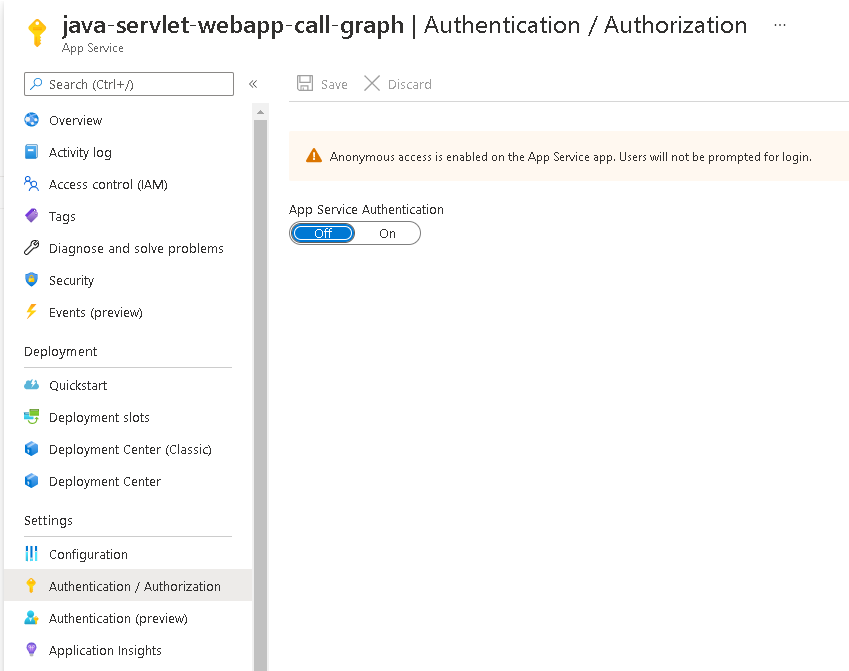

# Deploy your Java applications to Azure Cloud and use Azure App Service to manage your operations

- [Overview](#overview)
- [Prerequisites](#prerequisites)
- [Setup](#setup)
- [Registration](#registration)
  - [Register the web app](#register-the-web-app)
- [Deployment](#deployment)
  - [Step 1: Create a new app on Azure App Service](#step-1-create-a-new-app-on-azure-app-service)
  - [Step 2: Prepare the web app for deployment](#step-2-prepare-the-web-app-for-deployment)
  - [Step 3: Deploy the web app](#step-3-deploy-the-web-app)
  - [Step 4: Update your Azure AD App Registration](#step-4-update-your-azure-ad-app-registration)
- [We'd love your feedback!](#wed-love-your-feedback)
- [More information](#more-information)
- [Community Help and Support](#community-help-and-support)
- [Contributing](#contributing)
- [Code of Conduct](#code-of-conduct)

## Overview

This sample demonstrates how to deploy a Java Servlet web application that signs in users and calls graph to **Azure Cloud** using [Azure App Service](https://docs.microsoft.com/azure/app-service/). It is recommended that you clone the respository [Enable your Java Servlet webapp to sign in users and call Microsoft Graph with the Microsoft identity platform](https://github.com/azure-samples/ms-identity-java-servlet-authentication) and use the sample in the `2-Authorization-I/call-graph` directory for deployment. You may choose to follow these steps with a different sample or your own project, noting that the instructions here are specific to the sample listed.

## Prerequisites

- An Azure Active Directory (Azure AD) tenant. For more information on how to get an Azure AD tenant, see [How to get an Azure AD tenant](https://azure.microsoft.com/documentation/articles/active-directory-howto-tenant/)
- A [user account](https://docs.microsoft.com/azure/active-directory/fundamentals/add-users-azure-active-directory) in your **Azure AD** tenant.
- [Visual Studio Code](https://code.visualstudio.com/download) is recommended for running and editing this sample.
- [VS Code Azure Tools Extension](https://marketplace.visualstudio.com/items?itemName=ms-vscode.vscode-node-azure-pack) extension is recommended for interacting with **Azure** through VS Code interface.
- An **Azure subscription**. This sample uses the free tier of **Azure App Service**.

- [Maven 3.6](https://maven.apache.org/download.cgi) or higher installed and set up in path environment (i.e., callable via `mvn` command)
- [Maven extension for VSCode](https://marketplace.visualstudio.com/items?itemName=vscjava.vscode-maven)

## Setup

Follow the setup instructions in [Enable your Java Servlet webapp to sign in users and call Microsoft Graph with the Microsoft identity platform](https://github.com/Azure-Samples/ms-identity-msal-java-samples/tree/main/3.%20Java%20Servlet%20Web%20App%20Tutorial/1-Authentication/sign-in) sample.

## Registration

### Register the web app

Use an Azure AD application registration and its matching sample that that you have completed previously.
If you have not completed a sample yet, we recommend you proceed to complete [Enable your Java Servlet webapp to sign in users and call Microsoft Graph with the Microsoft identity platform](https://github.com/Azure-Samples/ms-identity-msal-java-samples/tree/main/3.%20Java%20Servlet%20Web%20App%20Tutorial/1-Authentication/sign-in) sample and use the app registration from it.

## Deployment

This guide is for deploying to **Azure App Service** via **VS Code Azure Tools Extension**. Follow these steps in a VSCode window with the workspace set to your copy of the [Enable your Java Servlet web app to sign in users and call Microsoft Graph with the Microsoft identity platform](https://github.com/Azure-Samples/ms-identity-msal-java-samples/tree/main/3.%20Java%20Servlet%20Web%20App%20Tutorial/1-Authentication/sign-in).

In order to get your deployed app fully functional, you must:

1. Create a new app on Azure App Service
1. Prepare the web app for deployment.
1. Deploy your project to **Azure App Service** and obtain a published website in the form of `https://example-domain.azurewebsites.net.`
1. Update your **Azure AD App Registration**'s redirect URIs from the **Azure Portal**, in order to include the redirect URI of your deployed Java Servlet application.

### Step 1: Create a new app on Azure App Service

1. Open the VSCode command palette (ctrl+shift+P on Windows and command+shift+P on Mac).
1. Choose  `Azure App Service: Create New Web App...`
1. Enter a globally unique name for your web app (e.g. `example-domain`) and press enter. Make a note of this name. If you chose `example-domain` for your app name, your app's domain name will be `https://example-domain.azurewebsites.net`
1. Select `Java 11` for your runtime stack.
1. Select `Tomcat 9.0` for your Java web server stack.

### Step 2: Prepare the web app for deployment

You must first modify the configuration files in your application.

- Go to your app's [properties file](./src/main/resources/authentication.properties) and change the value of `app.homePage` to your deployed app's domain name. For example, if you chose `example-domain` for your app name in [Step 1: Create a new app on Azure App Service](#step-1-create-a-new-app-on-azure-app-service), you must now use the value  `https://example-domain.azurewebsites.net`. Be sure that you have also changed the protocol from `http` to `https`.

```ini
# the default value was:
# app.homePage=http://localhost:8080/msal4j-servlet-webapp
# the correct format for the new value is as follows:
app.homePage=https://example-domain.azurewebsites.net
```

You **may skip the rest of this step** if you are doing a test deployment with a development Azure Active Directory App registration that does not have any sensitive data. **It is not secure to deploy secrets in a config file to a production application**. To deploy your app more securely, you must:

1. Supply a config file that omits secrets (i.e., `authentication.properties` that does not contain `aad.secret` and its value)
2. After you've deployed your app in the next sections, come back and add the secrets from a secure location such as:
   1. **Azure Key Vault**. Use the [Microsoft Azure Key Vault SDK for Java](https://github.com/Azure/azure-sdk-for-java/tree/master/sdk/keyvault). Set the client secret value in vault, naming it `CLIENT_SECRET` for example. Then set up the Azure key vault client in your app. Modify the `helpers/Config.java` file as follows:

         ```Java
         // remove this line:
         static final String SECRET = Config.getProperty("aad.secret");
         // replace it with this line:
         static final String SECRET = 
         yourFullyConfiguredAzureSecretClient.getSecret('CLIENT_SECRET')
         // See Key Vault SDK documentation here: https://azuresdkdocs.blob.core.windows.net/$web/java/azure-security-keyvault-secrets/4.2.3/overview-summary.html#retrieve-a-secret
         ```

   2. **Environment Variables** (*Azure Portal > App Services > `<Your App Name>` > Configuration*). Go to the Azure Portal and set the value for `CLIENT_SECRET`. Now, back in your local code, modify the following lines in the `helpers/Config.java` file as follows:

         ```Java
         // remove this line:
         static final String SECRET = Config.getProperty("aad.secret");
         // replace it with this line:
         static final String SECRET = System.getenv('CLIENT_SECRET')
         ```

3. If you are sure you want to continue, proceed to [Step 3](#step-3-deploy-the-web-app).

### Step 3: Deploy the web app

This guide is for deploying to **Azure App Service** via **VS Code Azure Tools Extension**.

1. Prepare a .WAR (web application repository) file.
    1. Open the VSCode command palette (ctrl+shift+P on Windows and command+shift+P on Mac).
    1. Click  `Maven: Execute Commands...`.
    1. Click `package`.
1. You should see the output of the command in your integrated VSCode terminal window. The words `BUILD SUCCESS` indicate that the .WAR file has been generated.
1. Now you must deploy the .WAR file to the app service you created earlier.
    1. Open the VSCode command palette (ctrl+shift+P on Windows and command+shift+P on Mac).
    1. Click  `Azure App Service: Deploy to Web App...`.
    1. Click `Browse...`.
    1. Navigate to the directory in which your copy of the sample in question is located. Now continue to the `target` directory therein. You should see a file with a .WAR extension. Choose this file for deployment.
    1. Select the web app that you created in [Step 1: Create a new app on Azure App Service](#step-1-create-a-new-app-on-azure-app-service) (e.g., `example-domain`)
    1. Choose the default port (`8080`) if you are asked to choose a port.
    1. Choose `Deploy` if there is a warning that the deployment will overwrite an existing deployment to this web app.
1. The deployment should be finished in a few minutes. A status message will appear at the bottom right of your VSCode window.You will be notified when the deployment completes.

### Step 4: Update your Azure AD App Registration

- Navigate to the home page of your deployed app; take note of and copy the **redirect_uri** displayed on the home page.
- Navigate back to to the [Azure Portal](https://portal.azure.com).
- In the left-hand navigation pane, select the **Azure Active Directory** service, and then select **App registrations**.
- In the resulting screen, select the name of your application.
- In the Authentication blade, paste the URI you copied earlier from your deployed app instance. If the app had multiple redirect URIs, make sure to add new corresponding entries using the App service's full domain in lieu of `http://localhost:8000` for each redirect URI. For example, this might be `https://example-domain.azurewebsites.net/auth/redirect`. Save the configuration.
- From the *Branding* menu, update the **Home page URL**, to the address of your service, for example `https://example-domain.azurewebsites.net/`. Save the configuration.
- Disable App Service's default authentication:

    Navigate to the **Azure App Service** Portal and locate your project. Once you do, click on the **Authentication/Authorization** blade. There, make sure that the **App Services Authentication** is switched off (and nothing else is checked), as this sample is using MSAL for authentication.

    
- You're done! Try navigating to the hosted app (e.g., `https://example-domain.azurewebsites.net/index`!

## We'd love your feedback!

Were we successful in addressing your learning objective? Consider taking a moment to [share your experience with us](https://forms.office.com/Pages/ResponsePage.aspx?id=v4j5cvGGr0GRqy180BHbR73pcsbpbxNJuZCMKN0lURpURDQwVUxQWENUMlpLUlA0QzdJNVE3TUJRSyQlQCN0PWcu).

## More information

- [Azure App Services](https://docs.microsoft.com/azure/app-service/)

For more information about how OAuth 2.0 protocols work in this scenario and other scenarios, see [Authentication Scenarios for Azure AD](https://docs.microsoft.com/azure/active-directory/develop/authentication-flows-app-scenarios).

## Community Help and Support

Use [Stack Overflow](http://stackoverflow.com/questions/tagged/msal) to get support from the community.
Ask your questions on Stack Overflow first and browse existing issues to see if someone has asked your question before.
Make sure that your questions or comments are tagged with [`azure-ad` `azure-ad-b2c` `ms-identity` `msal`].

If you find a bug in the sample, please raise the issue on [GitHub Issues](../../../../issues).

To provide a recommendation, visit the following [User Voice page](https://feedback.azure.com/forums/169401-azure-active-directory).

## Contributing

If you'd like to contribute to this sample, see [CONTRIBUTING.MD](../../CONTRIBUTING.md).

## Code of Conduct

This project has adopted the [Microsoft Open Source Code of Conduct](https://opensource.microsoft.com/codeofconduct/).
For more information see the [Code of Conduct FAQ](https://opensource.microsoft.com/codeofconduct/faq/) or
contact [opencode@microsoft.com](mailto:opencode@microsoft.com) with any additional questions or comments.
