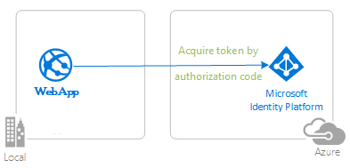

# Protect your Java Spring Boot web API with the Microsoft identity platform

- [Overview](#overview)
- [Scenario](#scenario)
- [Contents](#contents)
- [Prerequisites](#prerequisites)
- [Setup](#setup)
  - [Clone or download this repository](#clone-or-download-this-repository)
  - [Register the sample application(s) with your Azure Active Directory tenant](#register-the-sample-applications-with-your-azure-active-directory-tenant)
  - [Choose the Azure AD tenant where you want to create your applications](#choose-the-azure-ad-tenant-where-you-want-to-create-your-applications)
  - [Register the service app (java-spring-resource-api)](#register-the-service-app-java-spring-resource-api)
  - [Register the client app (java-spring-webapp-client)](#register-the-client-app-java-spring-webapp-client)
- [Running the sample](#running-the-sample)
- [Explore the sample](#explore-the-sample)
- [We'd love your feedback!](#wed-love-your-feedback)
- [About the code](#about-the-code)
  - [Project Initialization](#project-initialization)
  - [Access Token Claims](#access-token-claims)
  - [Protecting routes with AADWebSecurityConfigurerAdapter](#protecting-routes-with-aadwebsecurityconfigureradapter)
- [More information](#more-information)
- [Community Help and Support](#community-help-and-support)
- [Contributing](#contributing)

<!--  -->

## Overview

This sample demonstrates a Java Spring web application calling a Java Spring web API that is secured using Azure AD. It uses the [Azure AD Spring Boot Starter client library for Java](https://github.com/Azure/azure-sdk-for-java/tree/master/sdk/spring/azure-spring-boot-starter-active-directory). It uses the OAuth2.0 protocol.

## Scenario

1. The client Java Spring MVC web app leverages the Azure AD Spring Boot Starter client library for Java to sign-in a user and obtain an AccessToken from **Azure AD**.
2. The **Access Token** proves that the user is authorized by **Azure AD** to call protected routes on the Java Spring web API **Azure AD**.



## Contents

| File/folder       | Description                                |
|-------------------|--------------------------------------------|
| `AppCreationScripts/`                                                               | Scripts to automatically configure Azure AD app registrations.                              |
| `resource-api/`                                                                     | Java Spring protected resource web API.                                                     |
| `resource-api/pom.xml`                                                              | Application dependencies.                                                                   |
| `resource-api/src/main/resources/application.yml`                                   | Application and Azure AD Boot Starter Library Configuration.                                |
| `resource-api/src/main/java/.../msidentityspringbootwebapi/`                        | This directory contains the main application entry point, controller, and config classes.   |
| `resource-api/src/main/java/.../MsIdentitySpringBootWebapi.java`                    | Main class.                                                                                 |
| `resource-api/src/main/java/.../SampleController.java`                              | Controller with endpoint mappings.                                                          |
| `resource-api/src/main/java/.../SecurityConfig.java`                                | Security Configuration (e.g., which routes require authentication?).                        |
| `webapp/`                                                                           | The Java Spring Boot web app. See a web chapter for description of files.                   |
| `webapp/pom.xml`                                                                    | Application dependencies.                                                                   |
| `webapp/src/main/resources/templates/`                                              | Thymeleaf Templates for UI.                                                                 |
| `webapp/src/main/resources/application.yml`                                         | Application and Azure AD Boot Starter Library Configuration.                                |
| `webapp/src/main/java/.../msidentityspringbootwebapp/`                              | This directory contains the main application entry point, controller, and config classes.   |
| `webapp/src/main/java/.../MsIdentitySpringBootWebappApplication.java`               | Main class.                                                                                 |
| `webapp/src/main/java/.../SampleController.java`                                    | Controller with endpoint mappings.                                                          |
| `webapp/src/main/java/.../SecurityConfig.java`                                      | Security Configuration (e.g., which routes require authentication?).                        |
| `webapp/src/main/java/.../Utilities.java`                                           | Utility Class (e.g., filter ID token claims).                                               |
| `CHANGELOG.md`                                                                      | List of changes to the sample.                                                              |
| `CONTRIBUTING.md`                                                                   | Guidelines for contributing to the sample.                                                  |
| `LICENSE`                                                                           | The license for the sample.                                                                 |

## Prerequisites

- [JDK Version 15](https://jdk.java.net/15/). This sample has been developed on a system with Java 15 but may be compatible with other versions.
- [Maven 3](https://maven.apache.org/download.cgi)
- [Java Extension Pack for Visual Studio Code](https://marketplace.visualstudio.com/items?itemName=vscjava.vscode-java-pack) is recommended for running this sample in VSCode.
- An **Azure AD** tenant. For more information see: [How to get an Azure AD tenant](https://docs.microsoft.com/azure/active-directory/develop/quickstart-create-new-tenant)
- A user account in your **Azure AD** tenant. This sample will not work with a **personal Microsoft account**. Therefore, if you signed in to the [Azure portal](https://portal.azure.com) with a personal account and have never created a user account in your directory before, you need to do that now.

## Setup

### Clone or download this repository

From your shell or command line:

```console
    git clone https://github.com/Azure-Samples/ms-identity-java-spring-tutorial.git
    cd ms-identity-java-spring-tutorial
    cd 3-Authorization-II/protect-web-api
```

or download and extract the repository .zip file.

> :warning: To avoid path length limitations on Windows, we recommend cloning into a directory near the root of your drive.

### Register the sample application(s) with your Azure Active Directory tenant

There is one project in this sample. To register it, you can:

- follow the steps below for manually register your apps
- or use PowerShell scripts that:
  - **automatically** creates the Azure AD applications and related objects (passwords, permissions, dependencies) for you.
  - modify the projects' configuration files.

<details>
  <summary>Expand this section if you want to use this automation:</summary>

> :warning: If you have never used **Azure AD Powershell** before, we recommend you go through the [App Creation Scripts](./AppCreationScripts/AppCreationScripts.md) once to ensure that your environment is prepared correctly for this step.

1. On Windows, run PowerShell as **Administrator** and navigate to the root of the cloned directory
1. If you have never used Azure AD Powershell before, we recommend you go through the [App Creation Scripts](./AppCreationScripts/AppCreationScripts.md) once to ensure that your environment is prepared correctly for this step.
1. In PowerShell run:

   ```PowerShell
   Set-ExecutionPolicy -ExecutionPolicy RemoteSigned -Scope Process -Force
   ```

1. Run the script to create your Azure AD application and configure the code of the sample application accordingly.
1. In PowerShell run:

   ```PowerShell
   cd .\AppCreationScripts\
   .\Configure.ps1
   ```

   > Other ways of running the scripts are described in [App Creation Scripts](./AppCreationScripts/AppCreationScripts.md)
   > The scripts also provide a guide to automated application registration, configuration and removal which can help in your CI/CD scenarios.

</details>

### Choose the Azure AD tenant where you want to create your applications

As a first step you'll need to:

1. Sign in to the [Azure portal](https://portal.azure.com).
1. If your account is present in more than one Azure AD tenant, select your profile at the top right corner in the menu on top of the page, and then **switch directory** to change your portal session to the desired Azure AD tenant.

### Register the service app (java-spring-resource-api)

1. Navigate to the [Azure portal](https://portal.azure.com) and select the **Azure AD** service.
1. Select the **App Registrations** blade on the left, then select **New registration**.
1. In the **Register an application page** that appears, enter your application's registration information:
   - In the **Name** section, enter a meaningful application name that will be displayed to users of the app, for example `java-spring-resource-api`.
   - Under **Supported account types**, select **Accounts in this organizational directory only**.
1. Select **Register** to create the application.
1. In the app's registration screen, find and note the **Application (client) ID**. You use this value in your app's configuration file(s) later in your code.
1. Select **Save** to save your changes.
1. In the app's registration screen, select the **Certificates & secrets** blade in the left to open the page where we can generate secrets and upload certificates.
1. In the **Client secrets** section, select **New client secret**:
   - Type a key description (for instance `app secret`),
   - Select one of the available key durations (For example, **6 months** or **1 year**) as per your security posture.
   - The generated key value will be displayed when you select the **Add** button. Copy the generated value for use in the steps later.
   - You'll need this key later in your code's configuration files. This key value will not be displayed again, and is not retrievable by any other means, so make sure to note it from the Azure portal before navigating to any other screen or blade.
1. In the app's registration screen, select the **Expose an API** blade to the left to open the page where you can declare the parameters to expose this app as an API for which client applications can obtain [access tokens](https://docs.microsoft.com/azure/active-directory/develop/access-tokens) for.
The first thing that we need to do is to declare the unique [resource](https://docs.microsoft.com/azure/active-directory/develop/v2-oauth2-auth-code-flow) URI that the clients will be using to obtain access tokens for this Api. To declare an resource URI, follow the following steps:
   - Select `Set` next to the **Application ID URI** to generate a URI that is unique for this app.
   - For this sample, accept the proposed Application ID URI (`api://{clientId}`) by selecting **Save**.
1. All APIs have to publish a minimum of one [scope](https://docs.microsoft.com/azure/active-directory/develop/v2-oauth2-auth-code-flow#request-an-authorization-code) for the client's to obtain an access token successfully. To publish a scope, follow the following steps:
   - Select **Add a scope** button open the **Add a scope** screen and Enter the values as indicated below:
        - For **Scope name**, use `access_as_user`.
        - Select **Admins and users** options for **Who can consent?**.
        - For **Admin consent display name** type `Access java-spring-resource-api`.
        - For **Admin consent description** type `Allows the app to access java-spring-resource-api as the signed-in user.`
        - For **User consent display name** type `Access java-spring-resource-api`.
        - For **User consent description** type `Allow the application to access java-spring-resource-api on your behalf.`
        - Keep **State** as **Enabled**.
        - Select the **Add scope** button on the bottom to save this scope.
1. On the left-hand side menu, select the Manifest blade.
    - Set accessTokenAcceptedVersion property to 2.
    - Select Save.

#### Configure the service app (java-spring-resource-api) to use your app registration

Open the project in your IDE (like Visual Studio or Visual Studio Code) to configure the code.

> In the steps below, "ClientID" is the same as "Application ID" or "AppId".

1. Open the `resource-api\src\main\resources\application.yml` file.
1. Find the key `Enter_Your_Client_ID_Here` and replace the existing value with the application ID (clientId) of `java-spring-resource-api` app copied from the Azure portal.

### Register the client app (java-spring-webapp-client)

1. Navigate to the [Azure portal](https://portal.azure.com) and select the **Azure AD** service.
1. Select the **App Registrations** blade on the left, then select **New registration**.
1. In the **Register an application page** that appears, enter your application's registration information:
   - In the **Name** section, enter a meaningful application name that will be displayed to users of the app, for example `java-spring-webapp-client`.
   - Under **Supported account types**, select **Accounts in this organizational directory only**.
   - In the **Redirect URI (optional)** section, select **Web** in the combo-box and enter the following redirect URI: `http://localhost:8080/login/oauth2/code/`.
1. Select **Register** to create the application.
1. In the app's registration screen, find and note the **Application (client) ID**. You use this value in your app's configuration file(s) later in your code.
1. Select **Save** to save your changes.
1. In the app's registration screen, select the **API permissions** blade in the left to open the page where we add access to the APIs that your application needs.
   - Select the **Add a permission** button and then,
   - Ensure that the **My APIs** tab is selected.
   - In the list of APIs, select the API `java-spring-resource-api`.
   - In the **Delegated permissions** section, select the **Access 'java-spring-resource-api'** in the list. Use the search box if necessary.
   - Select the **Add permissions** button at the bottom.

#### Configure the client app (java-spring-webapp-client) to use your app registration

Open the project in your IDE (like Visual Studio or Visual Studio Code) to configure the code.

> In the steps below, "ClientID" is the same as "Application ID" or "AppId".

1. Open the `webapp\src\main\resources\application.yml` file.
1. Find the key `Enter_Your_Tenant_ID_Here` and replace the existing value with your Azure AD tenant ID.
1. Find the key `Enter_Your_Client_ID_Here` and replace the existing value with webApp.AppId.
1. Find the key `Enter_Your_Client_Secret_Here` and replace the existing value with the key you saved during the creation of `java-spring-webapp-client` copied from the Azure portal.

## Running the sample

1. Open a terminal or the integrated VSCode terminal.
1. In the same directory as this readme file, run `cd resource-api`. Then run `mvn clean compile spring-boot:run`.
1. Open a second terminal tab or the another integrated VSCode terminal.
1. In the same directory as this readme file, run `cd webapp`. Then run `mvn clean compile spring-boot:run`.
1. Open your browser and navigate to `http://localhost:8080`.


## Explore the sample

- Note the signed-in or signed-out status displayed at the center of the screen.
- Click the context-sensitive button at the top right (it will read `Sign In` on first run)
  - Alternatively, click the link to `token details`. Since this is a protected page that requires authentication, you'll be automatically redirected to the sign-in page.
- Follow the instructions on the next page to sign in with an account in the Azure AD tenant.
- On the consent screen, note the scopes that are being requested.
- Upon successful completion of the sign-in flow, you should be redirected to the home page (`sign in status`) or `token details` page, depending on which button triggered your sign-in flow.
- Note the context-sensitive button now says `Sign out` and displays your username to its left.
- If you are on the home page, you'll see an option to click **ID Token Details**: click it to see some of the ID token's decoded claims.
- You can also use the button on the top right to sign out. The status page will reflect this.

> :information_source: Did the sample not work for you as expected? Did you encounter issues trying this sample? Then please reach out to us using the [GitHub Issues](../../../../issues) page.

## We'd love your feedback!

Were we successful in addressing your learning objective? Consider taking a moment to [share your experience with us](https://forms.office.com/r/iTZtCTrZrH).

## About the code

This sample demonstrates how to use [Azure AD Spring Boot Starter client library for Java](https://docs.microsoft.com/java/api/overview/azure/active-directory-spring-boot-starter-readme?view=azure-java-stable) to sign in users into your Azure AD tenant. It also makes use of **Spring Oauth2 Client** and **Spring Web** boot starters. It uses claims from **ID Token** obtained from Azure Active Directory to display details of the signed-in user.

### Project Initialization

To make your own Spring boot resource API, create a new Java Maven project and copy the `pom.xml` file and the `src` folder within the `resource-api` directory of this repository.

### Access Token Claims

To extract token details, make use of Spring Security's `AuthenticationPrincipal` and `OidcUser` object in a request mapping. See the [Sample Controller](./resources/src/main/java/com/microsoft/azuresamples/msal4j/msidentityspringbootwebapi/SampleController.java) for an example of this app making use of ID Token claims.

```java
import org.springframework.security.oauth2.core.OAuth2AuthenticatedPrincipal;
import org.springframework.security.oauth2.server.resource.authentication.BearerTokenAuthentication;
//...
@GetMapping("/api/date")
@ResponseBody
@PreAuthorize("hasAuthority('SCOPE_access_as_user')")
public String date(BearerTokenAuthentication bearerTokenAuth) {
    OAuth2AuthenticatedPrincipal principal = (OAuth2AuthenticatedPrincipal) bearerTokenAuth.getPrincipal();
    return principal.getAttribute("scp").toString();
}
```

### Protecting routes with AADWebSecurityConfigurerAdapter

By default, this app protects all routes so that only users with a valid access token can access it. To configure your app's specific requirements, extend `AADWebSecurityConfigurationAdapter` in one of your classes. For an example, see this app's [SecurityConfig](.resource-api/src/main/java/com/microsoft/azuresamples/msal4j/msidentityspringbootwebapi/SecurityConfig.java) class.

This app also configures the correct claims validation for the incoming bearer token from the `app-id-uri` and `client-id` property the `application.yml` file.

```java
@EnableWebSecurity
@EnableGlobalMethodSecurity(prePostEnabled = true)
public class SecurityConfig extends AADResourceServerWebSecurityConfigurerAdapter {
    /**
     * Add configuration logic as needed.
     */
    @Override
    protected void configure(HttpSecurity http) throws Exception {
        super.configure(http);
        http.authorizeRequests((requests) -> requests.anyRequest().authenticated());
    }
}
```

## More information

- [Microsoft identity platform (Azure Active Directory for developers)](https://docs.microsoft.com/azure/active-directory/develop/)
- [Overview of Microsoft Authentication Library (MSAL)](https://docs.microsoft.com/azure/active-directory/develop/msal-overview)
- [Quickstart: Register an application with the Microsoft identity platform (Preview)](https://docs.microsoft.com/azure/active-directory/develop/quickstart-register-app)
- [Quickstart: Configure a client application to access web APIs (Preview)](https://docs.microsoft.com/azure/active-directory/develop/quickstart-configure-app-access-web-apis)
- [Understanding Azure AD application consent experiences](https://docs.microsoft.com/azure/active-directory/develop/application-consent-experience)
- [Understand user and admin consent](https://docs.microsoft.com/azure/active-directory/develop/howto-convert-app-to-be-multi-tenant#understand-user-and-admin-consent)
- [Application and service principal objects in Azure Active Directory](https://docs.microsoft.com/azure/active-directory/develop/app-objects-and-service-principals)
- [National Clouds](https://docs.microsoft.com/azure/active-directory/develop/authentication-national-cloud#app-registration-endpoints)
- [MSAL code samples](https://docs.microsoft.com/azure/active-directory/develop/sample-v2-code)
- [Azure Active Directory Spring Boot Starter client library for Java](https://github.com/Azure/azure-sdk-for-java/tree/master/sdk/spring/azure-spring-boot-starter-active-directory)
- [Microsoft Authentication Library for Java (MSAL4J)](https://github.com/AzureAD/microsoft-authentication-library-for-java)
- [MSAL4J Wiki](https://github.com/AzureAD/microsoft-authentication-library-for-java/wiki)
- [ID Tokens](https://docs.microsoft.com/azure/active-directory/develop/id-tokens)
- [Access Tokens](https://docs.microsoft.com/azure/active-directory/develop/access-tokens)

For more information about how OAuth 2.0 protocols work in this scenario and other scenarios, see [Authentication Scenarios for Azure AD](https://docs.microsoft.com/azure/active-directory/develop/authentication-flows-app-scenarios).

## Community Help and Support

Use [Stack Overflow](http://stackoverflow.com/questions/tagged/msal) to get support from the community.
Ask your questions on Stack Overflow first and browse existing issues to see if someone has asked your question before.
Make sure that your questions or comments are tagged with [`azure-active-directory` `azure-ad-b2c` `ms-identity` `adal` `msal`, `java`].

If you find a bug in the sample, raise the issue on [GitHub Issues](../../../../issues).

To provide feedback on or suggest features for Azure Active Directory, visit [User Voice page](https://feedback.azure.com/forums/169401-azure-active-directory).

## Contributing

If you'd like to contribute to this sample, see [CONTRIBUTING.MD](/CONTRIBUTING.md).

This project has adopted the [Microsoft Open Source Code of Conduct](https://opensource.microsoft.com/codeofconduct/). For more information, see the [Code of Conduct FAQ](https://opensource.microsoft.com/codeofconduct/faq/) or contact [opencode@microsoft.com](mailto:opencode@microsoft.com) with any additional questions or comments.
